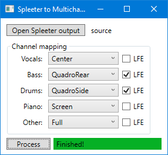

# Spleeter to Multichannel
Converts a stereo song or movie audio track separated by Deezer Spleeter to 7.1 surround sound.
This software is not a GUI for the entire Spleeter process.
Use [SpleeterGui by boy1dr](https://github.com/boy1dr/SpleeterGui) for the creation of 4- or 5-stem splits of any audio, then load the result folder into this application.
Each track is configurable for multiple upmixing matrices and LFE mixing, the default setting being the best option for front-to-rear volume reduction for most sources.

## Conversions
### Audio only

Use Spleeter or SpleeterGui to separate 4 or 5 parts of the source audio. For SpleeterGui, drag and drop any file on the window, video files also work.


Browse Spleeter's output folder in this application, and set up your preferred mixing layout.
The default settings are recommended for every kind of content.
Clicking Process will result in the creation of render.wav in the previously browsed folder.

### Videos
Do everything in the Audio only section, and use FFmpeg or something similar to recombine the rendered audio with the video track.
The FFmpeg command is the following:
```
ffmpeg -i {video} -i {audio} -map 0:v -map 1:a -c copy {output}
```
Using Opus as the audio codec is recommended, as it's transparent at default settings with extremely low bitrates:
```
ffmpeg -i {video} -i {audio} -map 0:v -map 1:a -c:v copy -c:a libopus {output}
```
Disclaimer: Opus and other transparent audio codecs are unsupported in every home theater product, and can only be played on PC.
Use stream copy for PCM codec if you want to play it on media players.

## Licence
The source code, just like the compiled software, is given to you for free, but without any warranty. It is not guaranteed to work, and the developer is not responsible for any damages from the use of the software. You are allowed to make any modifications, and release them for free under this licence. If you release a modified version, you have to link this repository as its source. You are not allowed to sell any part of the original or the modified version. You are also not allowed to show advertisements in the modified software. If you include these code or any part of the original version in any other project, these terms still apply.